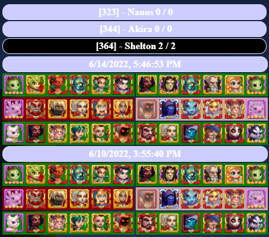

# Hero Wars Tamper Monkey Helper Script

### Author
Roger Willcocks

### Version
0.5

## Links
**Game:**  https://www.hero-wars.com/

**Repo:** https://github.com/rwil02/herowars

**TamperMonkey:** https://chrome.google.com/webstore/search/tampermonkey

## Current functionality
1. Track win/loss in Arena per opponent
2. Track win/loss in Grand Arena per opponent
3. Display teams for each battle for current opponents
4. Highlight where enemy teams are different from when last fought
5. Highlight which enemy heros are different within a team from when last fought
6. Limit history to last 500 battles for each of Arena and Grand Arena
7. Display last 5 battles only for each opponent

## Screenshot

